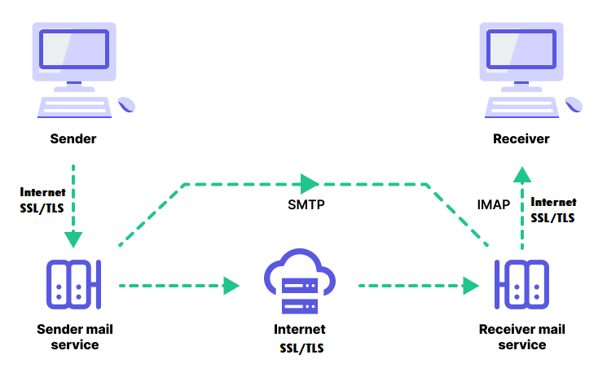

# Actividad 13
## Pregunta 1: Diseño de un sistema de entrega y recuperación de correo electrónico

**Contexto:** Una empresa necesita diseñar un sistema de correo electrónico robusto que utilice SMTP, IMAP, y SSL/TLS para la entrega y recuperación segura de correo electrónico.

**Algunos conceptos**
- **SMTP:** Protocolo que se usa para enviar correos electrónicos a través de internet.
- **IMAP:** Protocolo que se utilizada para recuperar correos electrónicos desde un servidor.
- **SSL/TLS:** Son protocolos que se utilizan para establecer una conexión segura a través de internet cifrando la información que se transmite de un cliente al servidor.

### Diagrama de red

### Escribir un pseudocódigo para la configuración del servidor SMTP y IMAP que también maneje conexiones SSL/TLS.

### Explicar cómo se gestionarán los certificados X.509 en este sistema y la importancia de estos para SSL/TLS.

### Discutir cómo se manejarán las direcciones IP dinámicas y estáticas dentro de esta red, especialmente en relación con DHCP y NAT.
